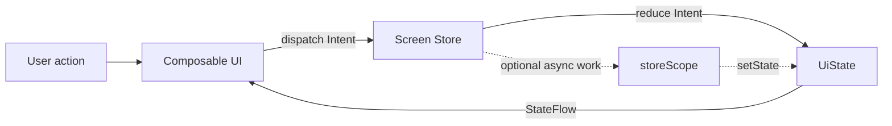
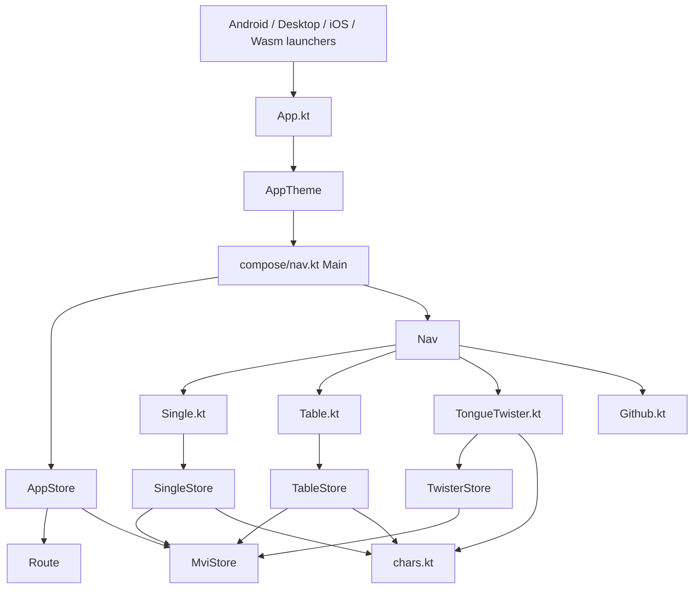
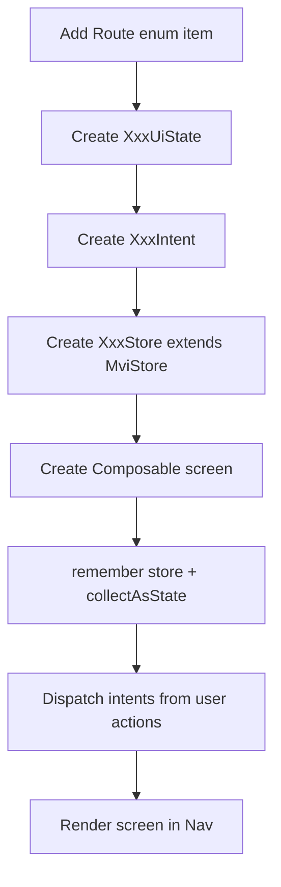

# JPSyllabary 架构说明

本文档记录当前项目的主要架构约定。项目是 Kotlin Multiplatform + Compose Multiplatform 应用，公共业务和 UI 位于 `shared/src/commonMain`，Android、Desktop、Wasm、iOS 入口复用同一套 shared 代码。

## 架构风格

当前业务页面采用轻量 MVI：

1. UI 只负责渲染 `UiState`。
2. 用户操作被建模为 `Intent`。
3. `Store` 接收 `Intent`，在 `reduce()` 中生成新的 `UiState`。
4. Compose 使用 `collectAsState()` 订阅 `Store.state`。
5. Composable 不直接持有业务状态，只保留必要的 UI 测量或控件内部状态。

数据流：

```text
User action -> Intent -> Store.dispatch() -> Store.reduce() -> UiState -> Compose render
```



## 模块关系



## 架构文件

`shared/src/commonMain/kotlin/App.kt`

共享应用入口。平台层启动后调用 `App()`，它套用主题并进入 `Main()`。

`shared/src/commonMain/kotlin/com/ohyooo/shared/mvi/MviStore.kt`

MVI 基类。提供 `StateFlow` 状态暴露、`dispatch(intent)` 入口、`setState {}` 状态更新和 `close()` 生命周期清理。新增页面 Store 应继承它。

`shared/src/commonMain/kotlin/com/ohyooo/shared/model/Route.kt`

顶层页面路由枚举。当前用于抽屉导航，后续如果引入导航库，也可以复用 `Route.value` 作为稳定 route 名称。

`shared/src/commonMain/kotlin/com/ohyooo/shared/viewmodel/AppStore.kt`

应用壳层 Store。管理当前选中的顶层路由，抽屉点击会派发 `AppIntent.SelectRoute`。

`shared/src/commonMain/kotlin/com/ohyooo/shared/viewmodel/SingleStore.kt`

单字训练页 Store。管理当前 kana、类别标题、罗马音提示和提示显示状态。UI 通过 `SingleIntent.Next` 获取下一张卡，通过 `SingleIntent.ToggleHint` 切换提示。

`shared/src/commonMain/kotlin/com/ohyooo/shared/viewmodel/TableStore.kt`

五十音表页 Store。管理当前页、罗马音来源、表格顺序、临时揭示的单元格、浮动按钮展开状态和拖拽偏移。排序、随机、点击单元格显示提示都通过 `TableIntent` 完成。

`shared/src/commonMain/kotlin/com/ohyooo/shared/viewmodel/TwisterStore.kt`

绕口令页 Store。管理重置请求信号，UI 监听 `resetRequest` 变化并将所有 pager 滚回第一页。

`shared/src/commonMain/kotlin/com/ohyooo/shared/compose/nav.kt`

应用壳层 UI。创建 `AppStore`，订阅 app state，渲染抽屉和当前页面，并把菜单打开回调传给各页面。

`shared/src/commonMain/kotlin/com/ohyooo/shared/compose/Single.kt`

单字训练页 UI。创建或接收 `SingleStore`，订阅 `SingleUiState`，把点击事件转成 `SingleIntent`。

`shared/src/commonMain/kotlin/com/ohyooo/shared/compose/Table.kt`

五十音表页 UI。创建或接收 `TableStore`，订阅 `TableUiState`，把 pager、单元格、浮动按钮操作转成 `TableIntent`。

`shared/src/commonMain/kotlin/com/ohyooo/shared/compose/TongueTwister.kt`

绕口令页 UI。创建或接收 `TwisterStore`，订阅 `TwisterUiState`，把重置按钮转成 `TwisterIntent.Reset`。

`shared/src/commonMain/kotlin/com/ohyooo/shared/model/chars.kt`

静态字符数据源。只保存 kana、romaji、绕口令和默认顺序数据，不再承担业务状态修改。

## 新增页面的推荐方式

1. 在 `model/Route.kt` 增加新的顶层 route。
2. 新建 `XxxUiState`、`XxxIntent`、`XxxStore : MviStore<XxxUiState, XxxIntent>`。
3. 在页面 Composable 中 `remember { XxxStore() }`，用 `DisposableEffect` 调用 `close()`。
4. 用 `val uiState by store.state.collectAsState()` 订阅状态。
5. 所有用户操作调用 `store.dispatch(XxxIntent...)`。
6. 在 `nav.kt` 的 `Nav()` 中按 route 渲染新页面。



## 维护约定

- Store 中可以做业务判断、状态转换和轻量异步逻辑。
- Composable 不直接修改业务状态。
- 静态模型文件只放不可变数据或纯函数，避免保存跨页面可变状态。
- 只把页面内部测量状态、动画状态、PagerState、ScaffoldState 这类 UI 控件状态留在 Composable。
- 新增架构类或关键方法时，同步补充 KDoc，说明用途和调用方式。
