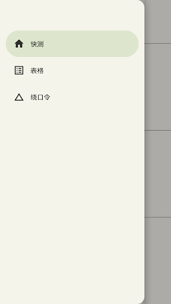
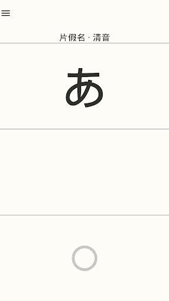
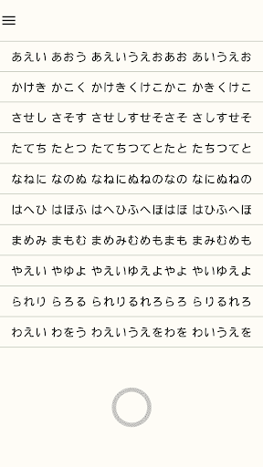
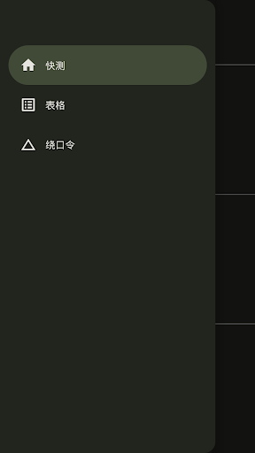
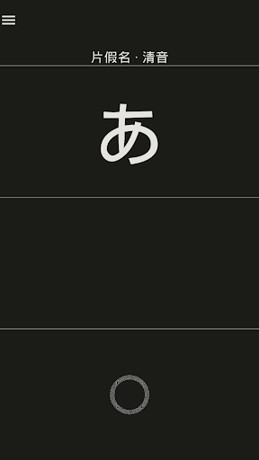
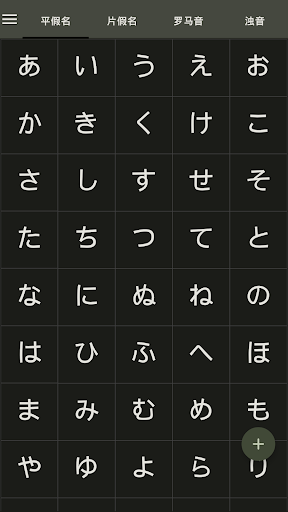
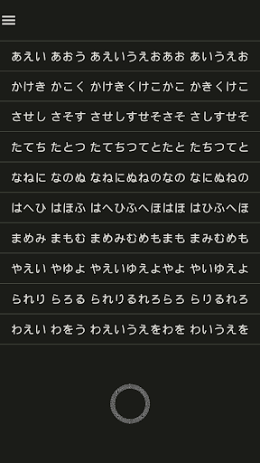

# JPSyllabary

JPSyllabary is a Kotlin Multiplatform application for learning the Japanese syllabary.

[](https://play.google.com/store/apps/details?id=com.ohyooo.jpsyllabary)

|       |       |       |       |
|:-------------------------------------------------------:|:-------------------------------------------------------:|:------------------------------------------------------:|:----------------------------------------------------:|
|  |  |  |  |

## Run the project

The project contains the following Gradle modules:

| Module | Target | How to run |
| --- | --- | --- |
| `:android` | Android application | Install on an emulator or connected device, then launch the main activity |
| `:desktop` | JVM desktop application | Run with the Compose Desktop Gradle task |
| `:shared` | Shared Kotlin Multiplatform code | Used by Android and Desktop; also provides the Web entry point and iOS XCFramework |

### Requirements

- JDK 25
- Android SDK and an emulator or connected device for Android
- macOS and Xcode for iOS framework builds

Commands below use the Unix-style wrapper, `./gradlew`. On Windows, replace it with `.\gradlew.bat`.

### Android

Install the debug application on a running emulator or connected device:

```shell
./gradlew :android:installDebug
```

Launch it from the device launcher, or start it with ADB:

```shell
adb shell am start -n com.ohyooo.jpsyllabary/.MainActivity
```

Alternatively, open the project in Android Studio and run the `android` configuration.

### Desktop

Start the desktop application for the current operating system:

```shell
./gradlew :desktop:run
```

### Web

Start the WebAssembly development server:

```shell
./gradlew :shared:wasmJsBrowserDevelopmentRun
```

For a production-mode preview, run:

```shell
./gradlew :shared:wasmJsBrowserProductionRun
```

Build static Web distributions without starting a server:

```shell
# Development distribution
./gradlew :shared:wasmJsBrowserDevelopmentExecutableDistribution

# Production distribution
./gradlew :shared:wasmJsBrowserDistribution
```

The generated files are written under `shared/build/dist/wasmJs/`.

### iOS

This repository currently exposes the shared iOS UI as an XCFramework and does not contain a standalone iOS application module. Build the framework on macOS, then integrate it into an Xcode application:

```shell
# Debug XCFramework
./gradlew :shared:assembleSharedDebugXCFramework

# Release XCFramework
./gradlew :shared:assembleSharedReleaseXCFramework
```

The generated frameworks are written to `shared/build/XCFrameworks/debug/Shared.xcframework` and `shared/build/XCFrameworks/release/Shared.xcframework`.
